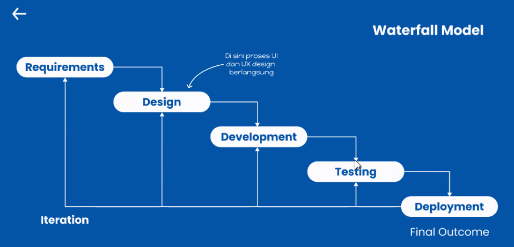
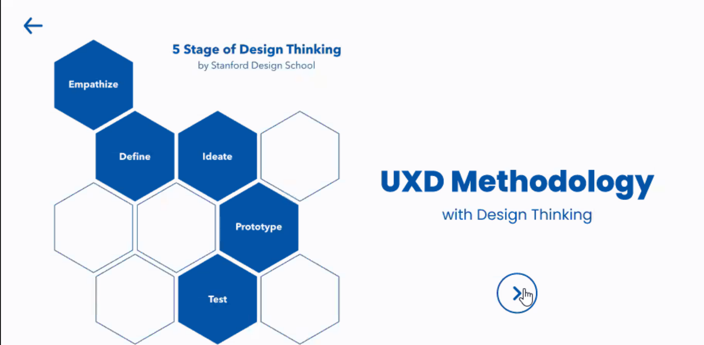
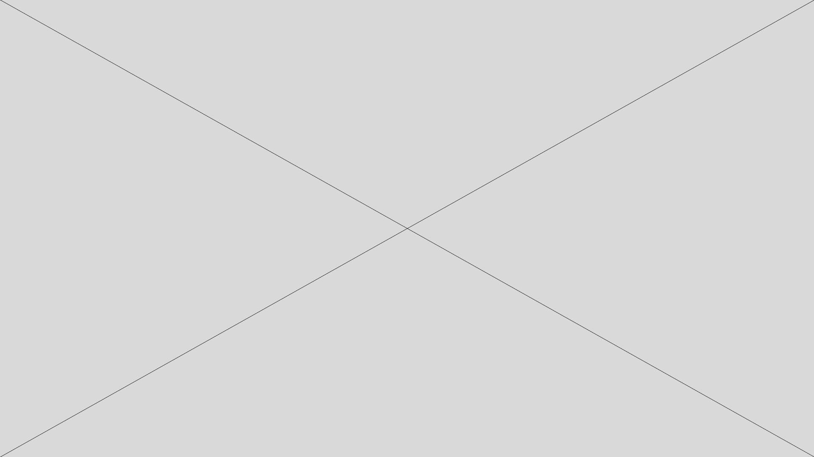
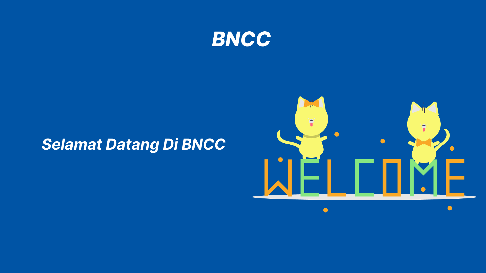

# UX UI Bootcamp Learning Material

## Waterfall Theory

 

In this Bootcamp, I learned about the waterfall theory. Waterfall is a classical model that is systematic, and sequential in building software. Waterfall is divided into several stages :

 

* Definition of Requirements (Software Requirements Analysis)
 

This method is a pre-design stage, which collects several requirements to create software. At this stage, company officials will analyze the needs of the target user. They will analyze data from user interaction from the device to the behavior of the user. at this stage, it will produce a PRD, namely details of what things the user needs are applied.

* System and Software Design (Design)
 

After producing the PRD, the work will proceed to the Designer, who will make a design according to these needs. In this stage it is divided into 2 namely UX and UI. at this stage the UX designer will do [Design Thinking](./readme.md#design-thinking) to help understand what the user needs. then the UI stage is where you make a design based on the problems that have been found.

* Implementation and Unit Testing (Code)
 

Here is the stage where the design prototype stage produced by the designers will be made real for the company to use in the future. This stage is divided into two major parts, namely the front end which is responsible for the appearance of the application interface, and the back end which is responsible for the data to be displayed.

* Testing System 
 

Testing is done to ensure that the errors made are minimal and the software results as desired. This stage is the stage where the final determination is whether the application is ready for use or not. If not, the product will be returned to the previous stage.

testing is not only at this stage, but also at all stages, even after deployment, there are still improvements that the company continues to make to make quality products.

 

## Design Thinking

 

* Emphatize
 

This stage has the goal of getting an empathetic understanding of the problem that is trying to be solved. The designer will conduct interviews, collect data to understand the problem that the target has. You could say that most of the main tasks of designers involve UX because they strive to put customer comfort first.

* Define
 

After gathering information during the Empathy stage. This is where we will analyze the problem to determine the core that has been identified. Define will help the designers in a team to collect great ideas to build features, and functions, to solve problems.

* Ideate
 

Then the ideate stage is the stage where the designers begin to generate ideas. We are given the freedom to give ideas even ideas that sound ridiculous or seem impossible because maybe that crazy thing is the answer to the existing problems.

* Prototype
 

The prototype stage which produces the number of low-cost versions of the product and the specific features found in the product, so that they can find solutions to the problems generated in the previous stage. 

* Test
 

At this stage the designer can evaluate whether their design is appropriate or not to overcome these problems.

## Training Camp
 

### Lofi

 

### Final

